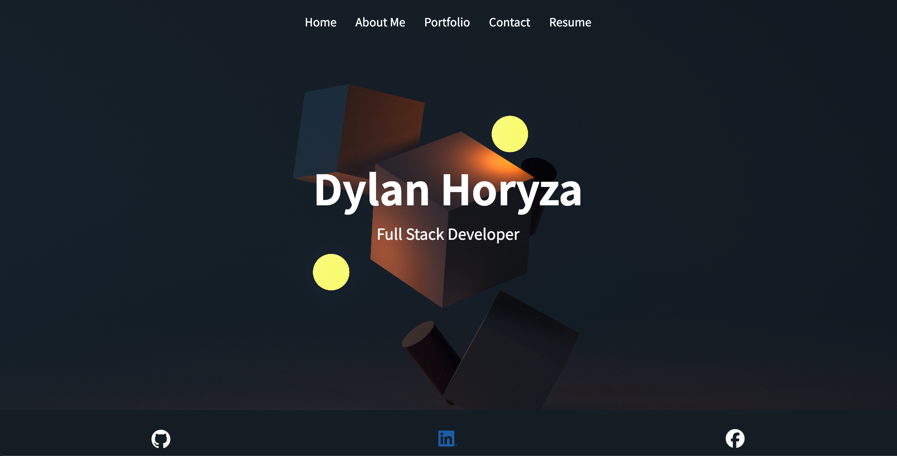
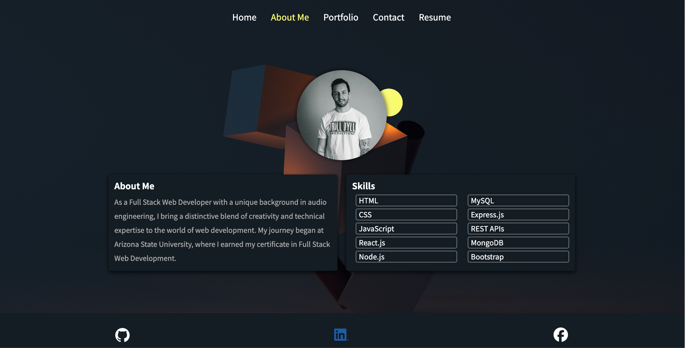
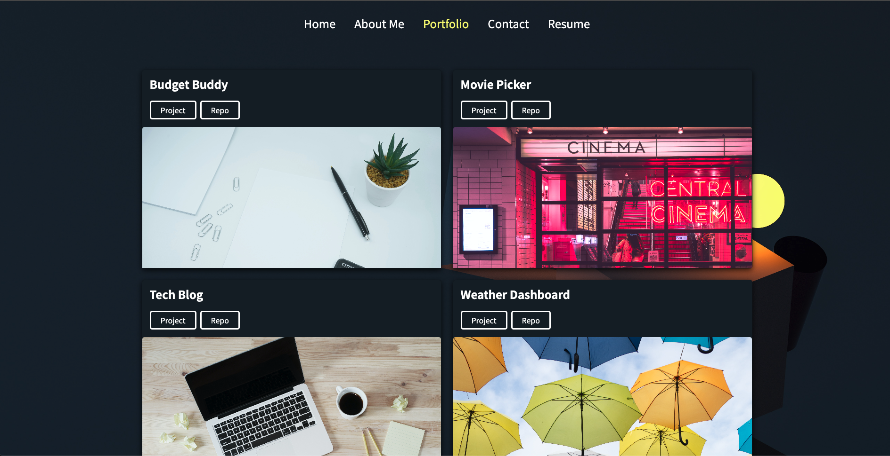
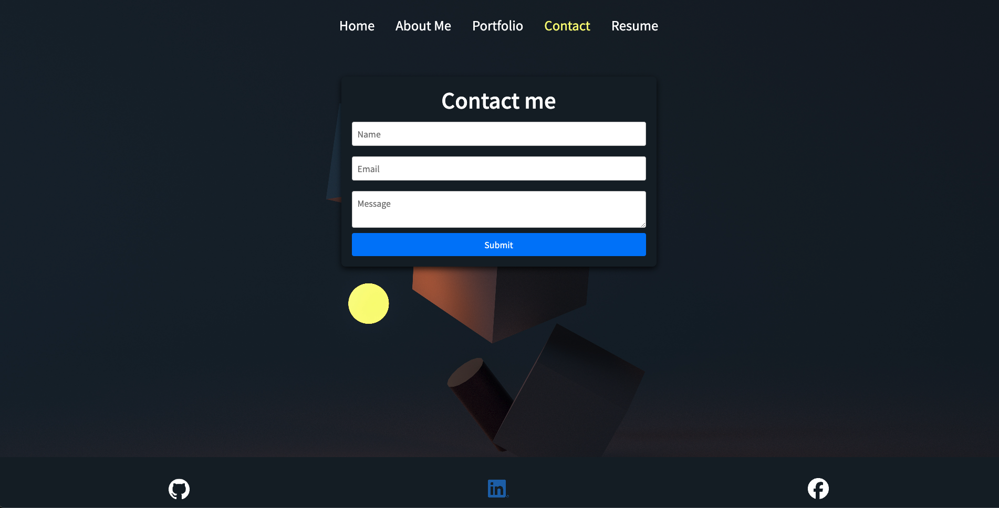
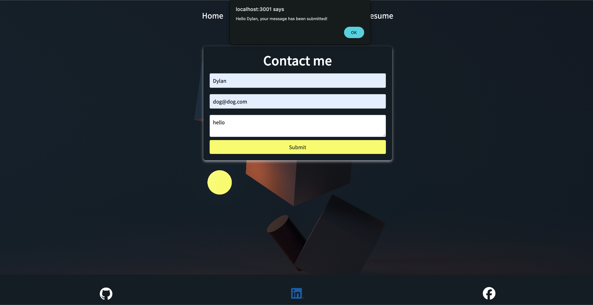
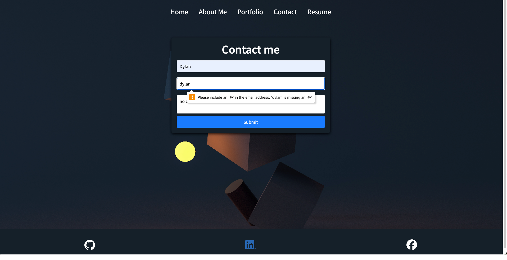
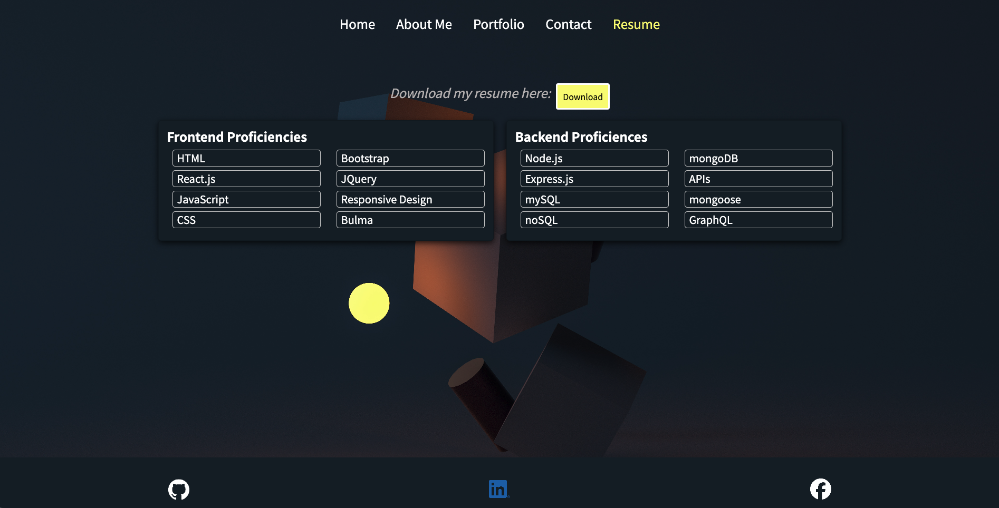

# React-Portfolio
## Description
- My motivation for this project was to be able to further understand how to use React to create a clean and polished UI.
- I built this project to have a professional portfolio that will show my skills to potential employers.
- This project solves the problem of having a centralized space for employers to see my work and contact me for potential job openings.
- I learned how to creat React components and how to dynamically create a clean portfolio with React and have different pages using React Router.
## Table of Contents 
- [Installation](#installation)
- [Usage](#usage)
- [Credits](#credits)
- [License](#license)
## Installation
To install this project, download the source code and run npm install. Next run npm start to launch the application. You can also just click on the deployed link below.
https://dylan-horyza-portfolio.netlify.app
## Usage
The following screenshots show how the portfolio works.
   
   
   
   
   
   
   
   
   
## Credits
N/A
## License
N/A

